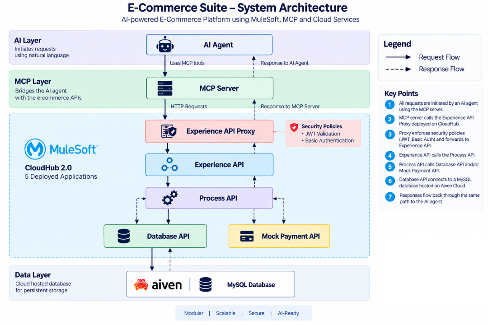

# E-Commerce Suite

> Operate a complete e-commerce application using natural language through an MCP-enabled AI agent — without a frontend, Postman, or API knowledge.

E-Commerce Suite is an API-led e-commerce platform built with MuleSoft and exposed to an AI agent through a Python-based MCP server.

Instead of interacting with the application through a traditional frontend or directly calling REST APIs, users can interact with the system using natural language through an MCP-enabled AI agent such as Claude.

For example:

> **User:** Show me some laptops under ₹80,000 with more than 4-star ratings.

Claude interprets the request, uses the appropriate MCP tool, and retrieves the relevant products from the e-commerce backend.

---

## Why I Built This

I wanted to build an e-commerce backend that could be used by someone who has no knowledge of APIs.

A traditional backend demonstration would usually involve a frontend application, Postman, or manually constructing API requests.

Instead, I wanted the interface to be natural language.

The goal was simple:

**The user should describe what they want, and the AI should handle the underlying API operations.**

---

## Demo

**[PLACEHOLDER — ADD DEMO VIDEO LINK]**

The complete demo shows a buyer journey performed through natural language:

```text
Search Products
      ↓
Filter Products
      ↓
Authentication
      ↓
Add to Cart
      ↓
Place Order
      ↓
View Orders
```

---

## Architecture

The application follows MuleSoft's API-led connectivity approach, with an MCP layer sitting on top of the backend.



### High-Level Flow

```text
                         AI Agent / Claude
                                │
                                ▼
                         Python MCP Server
                                │
                                ▼
                     Experience API Proxy
                                │
                                ▼
                        Experience API
                                │
                                ▼
                         Process API
                         /          \
                        /            \
                       ▼              ▼
                Database API     Mock Payment API
                       │
                       ▼
                   Aiven MySQL
```

### How It Works

The user interacts with the application using natural language through an AI agent.

The AI agent does not directly know how the backend is implemented. It interacts with the Python MCP server through MCP tools.

The MCP server translates the AI's intent into calls to the Experience API Proxy.

The request then flows through the MuleSoft API-led architecture:

1. **Experience API Proxy** — entry point for the exposed Experience API and policy enforcement.
2. **Experience API** — exposes the consumer-facing e-commerce operations.
3. **Process API** — handles business logic and orchestration.
4. **Database API** — provides access to the application's database.
5. **Mock Payment API** — simulates responses from a payment service.
6. **Aiven MySQL** — stores the application's persistent data.

This allows the same backend APIs to be operated through an AI agent without requiring the user to understand HTTP methods, request bodies, endpoints, or API parameters.

---

## MCP Integration

The Python MCP server exposes the e-commerce capabilities as MCP tools.

Some of the available capabilities include:

- Authentication
- Product search and filtering
- Product details
- Store management
- Cart operations
- Order placement
- Order retrieval
- Order cancellation
- Seller operations

Claude uses these tools to translate natural-language requests into actual backend operations.

For example:

```text
"Show me laptops under ₹80,000 with more than 4-star ratings."

                    ↓

              Claude interprets
                    ↓
             MCP tool call
                    ↓
          Experience API Proxy
                    ↓
              MuleSoft APIs
                    ↓
              Database API
                    ↓
               Aiven MySQL
                    ↓
             Products returned
                    ↓
               Claude responds
```

### MCP Server

**Repository:**  
[PLACEHOLDER — MCP SERVER GITHUB LINK]

The MCP server is built using Python and the MCP SDK.

---

## Application Capabilities

### Buyers

- Register and authenticate
- Browse products
- Filter products
- View product details
- Add products to cart
- Update cart quantities
- Remove products from cart
- Clear cart
- Place orders
- View buyer orders
- Cancel orders

### Sellers

- Register and authenticate
- Create stores
- Add products to stores
- Update products
- Restock products
- View seller orders
- Manage multiple stores

### Admin

- Initial admin setup
- View seller stores
- Verify seller stores

---

## Security

The application uses JWT-based authentication and authorization.

Protected operations require authentication, while public operations such as registration, login, and product browsing can be accessed without a JWT.

Authorization is handled within the MuleSoft application based on the authenticated user's identity and role.

The API gateway layer also applies authentication policies to protected endpoints.

The MCP server does not bypass the application's existing authorization model. It interacts with the same protected APIs that other clients would use.

---

## Repository Structure

The project is divided into multiple repositories based on the API-led architecture and MCP integration.

| Component | Description | Repository |
|---|---|---|
| Experience API | Consumer-facing e-commerce API | [PLACEHOLDER] |
| Process API | Business logic and orchestration | [PLACEHOLDER] |
| Database API | Database access layer | [PLACEHOLDER] |
| Mock Payment API | Mock payment service | [PLACEHOLDER] |
| MCP Server | Python MCP server exposing e-commerce capabilities | [PLACEHOLDER] |

---

## Technology Stack

### MuleSoft

- Anypoint Platform
- Anypoint Studio
- RAML
- APIKit
- DataWeave
- MUnit
- API Manager
- CloudHub 2.0

### AI / MCP

- Python
- MCP
- Claude

### Database

- MySQL
- Aiven

### Deployment

- Mule Runtime
- CloudHub 2.0

---

## API-Led Architecture

The backend follows a layered API-led architecture.

### Experience Layer

The Experience layer exposes APIs designed around the needs of the consumer-facing application.

**Experience API Repository:**  
[PLACEHOLDER — EXPERIENCE API REPOSITORY LINK]

### Process Layer

The Process layer contains business logic and orchestrates interactions between different system APIs.

**Process API Repository:**  
[PLACEHOLDER — PROCESS API REPOSITORY LINK]

### System Layer

The System layer abstracts access to external systems.

The project currently contains:

- Database API
- Mock Payment API

**Database API Repository:**  
[PLACEHOLDER — DATABASE API REPOSITORY LINK]

**Mock Payment API Repository:**  
[PLACEHOLDER — MOCK PAYMENT API REPOSITORY LINK]

---

## Deployment

The MuleSoft applications are deployed to CloudHub 2.0.

The MCP server runs separately as a Python application and communicates with the deployed Experience API through the API proxy.

**CloudHub / Deployment Details:**  
[PLACEHOLDER — DEPLOYMENT DOCUMENTATION LINK]

---

## Project Walkthrough

For a detailed explanation of how the project was designed, the engineering decisions behind it, and the problems encountered while building it:

**[PLACEHOLDER — MEDIUM ARTICLE LINK]**

---

## Video

**[PLACEHOLDER — PROJECT DEMO VIDEO LINK]**

---

## Project Status

The core e-commerce workflow and MCP integration are implemented and functional.

The project is primarily intended as a portfolio project demonstrating:

- API-led architecture
- MuleSoft development
- REST API integration
- Authentication and authorization
- Database integration
- MCP integration
- AI-assisted API interaction
- Cloud deployment

---

## Author

**Anurag**

Software Developer interested in:

- Backend Engineering
- API Integrations
- AI-powered applications
- MCP
- Cloud technologies

**LinkedIn:** [PLACEHOLDER — LINKEDIN LINK]

**GitHub:** [PLACEHOLDER — GITHUB PROFILE LINK]

**Medium:** [PLACEHOLDER — MEDIUM PROFILE LINK]
